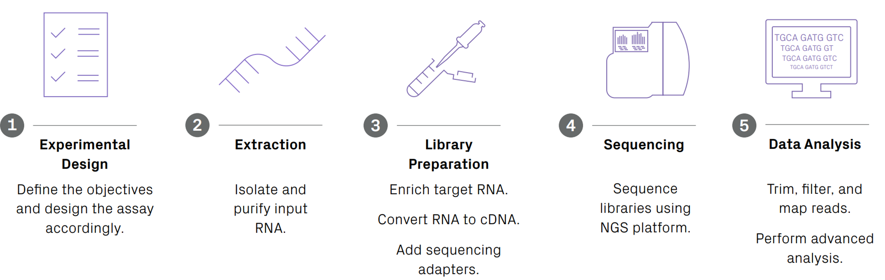
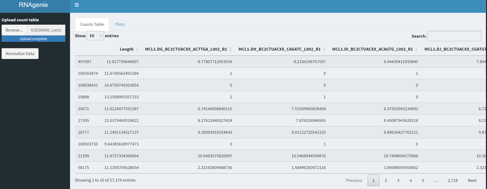

# **Pipeline for RNA-seq experiments: From Raw Reads to Expressed Genes**

## **Abstract**

RNA sequencing (RNA-seq) pipeline is a term used to describe the different steps to analyze gene expression data generated through RNA-seq experiments. The analysis begins with quality check of the raw reads followed by quality control where the raw reads are trimmed. Then, the processing steps include alignment, quantification, normalization, and differential expression analysis. Here we present a simple RNA-seq data analysis pipeline that integrates popular software tools, including FastQC, MultiQC, cutadapt, HISAT2, featurecounts, and DESeq2, to process and analyze RNA-seq data generated from RNA-seq experiments. The pipeline is implemented in a bash script and R Shiny, a web application framework that allows for interactive visualization. The efficacy of the pipeline was demonstrated using a mouse mammary gland RNA data. The pipeline serves as a platform for gene expression analysis, which can be further adapted for other RNA-seq datasets.

## **Project Objectives**

1. Create a simple RNA-Seq pipeline to identify differentially expressed genes.
2. Create a public interface to visualize the results of the pipeline.

## **Background**

RNA-seq is a type of high-throughput sequencing technique used to study the transcriptome, which is the complete set of RNA molecules produced by a cell or population of cells (Batut et al., 2023). This allows the high-throughput profiling of both coding and non-coding RNA with single-nucleotide resolution (Azenta, 2022). Studying the transcriptome offers researchers the advantage of knowing what genes may or may not be expressed.

While RNA-Seq generates a vast amount of data that can be difficult to analyze, it offers several valuable insights into transcriptomic analyses. According to the RNA-Seq workbook (Azenta, 2022), the most common applications of RNA-Seq data include the following:

1. Changes in gene expression
2. De Novo Transcript Assembly
3. Novel Transcript Discovery

RNA-seq technique is now more accessible to researchers thanks to innovations in next generation sequencing technology, which have significantly decreased the cost of sequencing. Analyzing the RNA-seq data is the final step in the experiment, and choosing the appropriate software is crucial for performing quality control measures, correcting biases, and ultimately answering the research questions posed by the study (Azenta, 2022). The complete steps involved in the RNA workflow are presented in Figure 1.

<figure>
  <figcaption><strong>Figure 1.</strong> RNA-Seq Workflow: From Experimental Design to Data Analysis.</figcaption>
  
</figure>

### **Motivation**

The motivation for developing the RNA-seq pipeline and R Shiny dashboard is primarily driven by the need to analyze and gain insights into gene expression data. Analyzing RNA sequencing data can be challenging and complicated. However, analyzing RNA-seq is important as it can be used in cancer research where the RNA-seq data can help discover biomarkers (Hong et al., 2020). Thereby, another motivation for creating the RNA-seq pipeline and R Shiny dashboard to visualize the results includes the ability to generate comprehensive and customizable analyses that are tailored to specific research questions.

### **Significance**

The significance of creating an RNA-seq pipeline and R Shiny dashboard lies in the ability to generate user-friendly visualizations of RNA-seq data. R Shiny dashboards offer interactive and easy-to-use data visualization to present the results of the RNA-seq pipeline. Therefore, R Shiny dashboards would allow researchers to have visualizations that can present gene expression data information in a more usable, and hopefully  comprehensive way to wider audiences. In addition, the bash pipeline will automate the analysis of RNA sequencing data by incorporating a variety of tools. The goal of the pipeline is to make the analysis of RNA-seq data more efficient and accurate.

### **Novelty**

The novelty of creating a bash RNA-seq pipeline that is based on a Galaxy module is that it allows for greater flexibility and customization.  By using the Galaxy module as a starting base, the pipeline was modified to include steps that were thought to be relevant. This means that the pipeline could be modified to include experiment-specific settings. The Galaxy module included information from raw reads to transcript quantification. The project presented here stopped the bash script in the expression quantification similar to the Galaxy module. However, it is also important to note that the Galaxy module that was used as a starting point had a second version that included the identification of differentially expressed genes. While the both Galaxy modules are helpful to see the process RNA-seq data, the results are not interactive. Therefore, the R-shiny is being used to provide users with a user-friendly interface to interact with the data.

## **Project components**

For the project, I decided to use the following components:

1. A reproducible bash shell script.
In the context of this project, a reproducible bash script was designed to automate the processing of RNA-seq data. In the documentation section, the script was documented with instructions so that other users can easily reproduce the analysis. The script also includes some checkpoints in the beginning to make sure that the input is appropriate and the pipeline runs with no errors.

2. A public facing interface.
In the context of this project, the public interface was developed using R Shiny to enable users to input their count table generated from the bash script. The purpose of using R-shiny is so that users can visualize the results in an easy to interpret manner. To provide more flexibility, the script used to create the interface will be provided so that other users can modify it if they wish.

## **Documentation**

### Pipeline overview

This pipeline is designed to take RNA sequencing data from organisms with a reference genome. The RNA seq analysis consists of 5 steps:

- Step 1: Quality check of raw reads using FastQC and report aggregation with multiqc.
- Step 2: Trimming low quality reads using Cutadapt.
- Step 3: Align raw reads to reference genome using HISAT2.
- Step 4: Transcript quantification using featureCounts.
- Step 5: Visualization of the count table and basic differential gene expression using R-shiny.

## Dependencies
The tools used in the pipeline were downloaded using conda. Steps on how to download conda can be found [here]("https://docs.conda.io/en/latest/miniconda.html"). The dependencies for the pipeline.sh script include the following:
1. FastQC version 0.11.8 (Andrews, 2010)
2. MultiQC version 1.14 (Ewels, 2016)
3. Cutadapt version 4.4 (Martin, 2011)
4. HISAT2 version 2.2.1 (Kim et al., 2019)
4. Subread version 2.0.3 (Liao et al., 2014)
6. sra-tools version 3.0.3 (Leinonen et al., 2010)

From the above dependencies, it is important to note that Subread contains the featureCounts tools. To install the dependencies the following conda commands can be performed:
```bash
conda create --name rna_pipeline python=3.7.3
conda install -c bioconda fastqc=0.11.8
conda install multiqc=1.14
conda install -c bioconda hisat2=2.2.1
conda install -c bioconda subread=2.0.3
conda install -c bioconda sra-tools=3.0.3
```
It is important to note that the sra-tools is only necessary if the data will be downloaded directly from the sra toolkit instead of the demo version. More information on how to download the data will be provided in the data provenance section.

## Data Provenance

Data files used as input to test the bash script pipeline come from the [RNA-Seq reads to counts]("https://training.galaxyproject.org/training-material/topics/transcriptomics/tutorials/rna-seq-reads-to-counts/tutorial.html#mapping") galaxy module (Doyle et al., 2023). The data from this Galaxy module was chosen as the authors of the module also included a short version of the raw reads (1000 bases long). So, it was convenient to test the bash script pipeline I was creating. To download the data a bash script called data_download.sh script was created. The script can be found in the pipeline folder.

It is important to note that the RNA data comes from an experiment perform by Fu et al. (2015) where the aim of their research was to investigate the expression patterns of basal and luminal cells in the mammary gland of virgin, pregnant, and lactating mice. There were a total of six groups, each corresponding to a specific combination of cell type and mouse status. It should be noted that two biological replicates were used in their study.

Raw data and count table for these samples can be downloaded from the Gene Expression Omnibus (GEO) using the GEO accession number [GSE60450]("https://www.ncbi.nlm.nih.gov/geo/query/acc.cgi?acc=GSE60450").

To download the data, the fasterq-dump command (NCBI Sequence Read Archive: SRA Download, n.d) can be used. So, that all dependencies are in the same conda environment, the sra-tools (conda version of the sra toolkit) can be used. The raw data of the samples can be downloaded using the following for loop:

```bash
for run_id in $(cat /path/to/run_id_list.txt); do fasterq-dump --split-files $run_id --gzip -O fastq_files; done
```

The above command expects that the run id numbers of each sample must be in a txt file called run_id_list.txt. The name of the file can be modified to any name you wish as long as the run id numbers are in a plain text file with a single name per line, like this:

```bash
SRR1552455
SRR1552454
SRR1552453
SRR1552452
```

When the for loop stops running, all output files will be found in the fastq_files folder. The name fastq_file can also be changed to any name, however, remember to change the name in the config.sh otherwise the pipeline.sh script will not run. More information on how to run the pipeline will be provided in the documentation section. Also, the complete list of the run ids used in the Fu et al. (2015) experiment can be found in the demo folder, which is located in the pipeline folder.

Using the command-line, the count table can be obtained using the following commands:

```bash
wget -P demo_count_table "https://ftp.ncbi.nlm.nih.gov/geo/series/GSE60nnn/GSE60450/suppl/GSE60450_Lactation-GenewiseCounts.txt.gz"
gunzip GSE60450_Lactation-GenewiseCounts.txt.gz
```

Further information on experimental design and sample preparation is also available from GEO under this accession number. Additionally, this repository contains a demo folder inside the pipeline folder where the count table has already been downloaded.

## Users

The proposed RNA-seq pipeline using Bash and R-Shiny to visualize the results has the potential to be used by researchers and bioinformaticians. For example, researchers investigating gene expression changes may find this pipeline useful for analyzing their RNA-seq data. Additionally, bioinformaticians who want to learn how to create an RNA-seq pipeline using Bash and R-shiny may find this pipeline valuable.  Because this pipeline is designed to be reproducible, it can be adapted to a variety of research contexts and data requirements.

### Running RNA-seq pipeline

To run the script with the RNA-seq pipeline, the user needs to follow these steps:

1. Download the two .sh extension scripts found in the pipeline folder. The pipeline.sh script contains the entire RNA-seq pipeline. The config.sh script contains the configuration of the pipeline with the appropriate parameters and options for analysis.
2. Open a terminal or command prompt and navigate to the directory that contains the pipeline.sh and the config.sh scripts.
3. Make the scripts executable using the chmod command:

```bash
chmod +x pipeline.sh
chmod +x config.sh
```

4. Run the script using the ./ prefix and the name of the script file:

```bash
./pipeline.sh
```

When the pipeline.sh script runs, it will read the parameters and options from the config.sh script and process the input files as specified. If there are any errors or warnings, the script will display them in the terminal output. When the script finishes, it will display the total time elapsed for the analysis. Users can modify all variables found in the config.sh script and adapt it to their needs. Currently the `working_dir` is set to rna_seq_pipeline, but users can modify it to include any name they want. Changing the name will not alter the final results of the pipeline. The same goes with the `input_dir,` `index_dir,` `annotation_dir.` Similarly, users can also change the `standard_illumina_adapter` for any adapter they wish to use as long as it is for single-end data. Also, depending on computing resources, the `threads` can be changed to the right amount of processing power. This could help in decreasing any unnecessary delay. The configuration.sh script has some cutadapt parameters that include the `minimum_read_length` and `quality_cutoff` which the user can also changed according to their needs.

For example purposes, if two samples are present in the`input_dir`, the pipeline.sh script will generate the following file structure:

```tree
├── alignment
│   ├── bam_files
│   │   ├── sample1_aligned.bam
│   │   └── sample2_aligned.bam
│   └── sam_files
│       ├── sample1_aligned.sam
│       └── sample2_aligned.sam
├── counts
│   ├── count_table.txt
│   └── count_table.txt.summary
├── quality_control
│   ├── quality_check
│   │   ├── multiqc_results
│   │   │   ├── post_alignment
│   │   │   │   ├── multiqc_data
│   │   │   │   └── multiqc_report.html
│   │   │   ├── post_trimming
│   │   │   │   ├── multiqc_data
│   │   │   │   └── multiqc_report.html
│   │   │   └── pre_trimming
│   │   │       ├── multiqc_data
│   │   │       └── multiqc_report.html
│   │   ├── post_alignment
│   │   │   ├── sample1_fastqc.html
│   │   │   ├── sample1_fastqc.zip
│   │   │   ├── sample2_fastqc.html
│   │   │   └── sample2_fastqc.zip
│   │   ├── post_trimming
│   │   │   ├── sample1_fastqc.html
│   │   │   ├── sample1_fastqc.zip
│   │   │   ├── sample2_fastqc.html
│   │   │   └── sample2_fastqc.zip
│   │   ├── pre_trimming
│   │   │   ├── sample1_trimmed_fastqc.html
│   │   │   ├── sample1_trimmed_fastqc.zip
│   │   │   ├── sample2_trimmed_fastqc.html
│   │   │   └── sample2_trimmed_fastqc.zip
│   └── trimming
│       ├── sample1_trimmed.fastq.gz
│       └── sample2_trimmed.fastq.gz
└── temp

```

### Command-line requirements

The pipeline.sh script only accepts data in the format of `fastq.gz`. It also only accepts single-end data that is unstranded.

If the user does not provide an input directory, the following message will be displayed:

```bash
Please provide an input directory with fastq files. Supported file format is .fastq.gz
```

If the input directory does not contain `.fastq.gz` files but the user specified the directory as input file, the following error will be displayed:

```bash
The input directory /path/provided/with/fastq_files does not contain any valid fastq files.
```

If the user sets an input directory that does not exist, the following will be displayed:

```bash
The input directory /path/provided/with/fastq_files does not exist.
```

### Reference Genome for Alignment

One of the steps of the RNA-seq workflow requires samples to be aligned to a reference genome. For this pipeline, HISAT2 is used to map the reads to the reference genome. HISAT2 provides a list of reference genomes that have already been indexed and can be found [here](http://daehwankimlab.github.io/hisat2/download/). To download the index files provided in HISAT2, the following steps can be performed:

```bash
# Download index for mouse and save it in a new directory
wget -P /path/to/new/directory/ "https://genome-idx.s3.amazonaws.com/hisat/mm10_genome.tar.gz"
gunzip mm10_genome.tar.gz
tar -xzvf mm10_genome.tar
```

Take note of the name that you give when saving the index to the directory as the path to the directory found in the config.sh script can be updated with the information from the directory. It is also important to note that when specifying the path of the config.sh script for the index file using HISAT2, the name of the base name of the index files must be specified. For example, if we download the mouse index files, and our username is user1, the path in the config.sh script must be specified as follow:

```bash
index_dir=/home/user1/rna_pipeline/genome_index/mm10/genome
```

### Reference Genome for Annotation

To perform the transcriptome quantifications, the featureCount tool is used in the pipeline. One important consideration to keep in mind when annotating your own data is that you will have to provide a reference genome in gtf format. Genomes can be retrieved from the Ensembl FTP site. If you click [here]("https://useast.ensembl.org/index.html"), you will be able to navigate to the Esembl website and find your organism of interest. By right-clicking on the name of the gtf you will be able to copy the URL and then paste into the command-line and download the file. For example, if we were to download the mouse genome we can follow the following steps:

```bash
# Download genome and save it in a new directory
wget -P /path/to/new/directory/ "https://ftp.ensembl.org/pub/release-109/gtf/mus_musculus/Mus_musculus.GRCm39.109.gtf.gz"
gunzip Mus_musculus.GRCm39.109.gtf.gz
```

Another consideration is that by default, the pipeline.sh script will not count mulit-overlapping reads. This decision was based on the [SubreadUsersGuide.pdf]("https://bioconductor.org/packages/release/bioc/vignettes/Rsubread/inst/doc/SubreadUsersGuide.pdf"), where for RNA experiments they recommended not to use multi-overlapping.

### Visualization using R-shiny

The R Shiny dashboard can be accessed at https://lyra.shinyapps.io/RNAgenie. The dashboard accepts a count table generated from the featureCounts program as input or any other tool as long as the table only has numeric data and the sample name are in columns like this:

| gene_id | sample1 | sample2 | sample3 | sample4 |
| --- | --- | --- | --- | --- |
| value1 | value1 | value1 | value1 | value1 |
| value2 | value2 | value2 | value2 | valu2 |

If your count table is not similar to the table as shown above, please modify it. If you run the pipeline.sh script, the count_table.txt file will contain some extra columns. Therefore, before uploading the count_table.txt file into the dashboard please eliminate those columns. Alternatively, for testing purposes, you can use the count table that is present in the demo folder that is located in the pipeline folders. The name of the count table in the demo folder is GSE60450_Lactation-GenewiseCounts.txt. 

Users can normalize the data using limma voom and explore the raw count data, normalized count data, a pca plot, and a log transformation of the data through a boxplot. Keep in mind that to visualize the plots, the Normalize Data button must be clicked. Also, the server may be a little slow when loading the info so you must wait for it to load completely. There is also a chance that the dashboard may not work in the server. If that happens, open the folder named visualizations present in this repository and download the app.R script. In R studio open the app.R script and dowload all the dependencies using the following command:

```R
install.packages(c("shinydashboard", "pheatmap", "ggrepel", "ggplot2", "plotly"))
```

Bioconductor packages will also need to be installed. The following commnad can be used:

```R
# Install Bioconductor if not already installed
if (!requireNamespace("BiocManager", quietly = TRUE))
  install.packages("BiocManager")

# Install Bioconductor packages
BiocManager::install(c("limma", "edgeR))
```

Also, note that the shiny package is needed and will automatically added when you create the shiny web app in R studio. A depiction on how the dashboard looks when a count table is uploaded is presented in Figure 2.

<figure>
  <figcaption><strong>Figure 2.</strong> Visualization of count table using R Shiny dashboard.</figcaption>
  
</figure>

## Implementation constraints

The RNA-seq pipeline and R Shiny app were created for educational purposes, which imposed several limitations on the scope of what both artifacts could do. One of the primary constraints was time, which limited the complexity of the analysis that could be performed. Consequently, both artifacts provided a basic analysis of the RNA-seq data and visualization, rather than a comprehensive analysis.

Creating a Bash script required technical skills in working with command-line commands, which was another skill limitation. Before taking the class, I had some knowledge of bash and R but needed to learn more. The script was improved by declaring variables at the beginning, which can make it more efficient for users to change elements as needed. I also created a config.sh file, to facilitate the work of users if they need to change variables without modifying the code of the pipeline itself.

Lack of software skills was another constraint. While I had some experience with FastQC, MultiQC, and Cutadapt, I had limited experience with other tools like HISAT2 and featureCounts. Also, I had never used R shiny to create visually appealing plots. So, I read the manuals on the tools on how to properly used the tools. However, when it came to implement the code for the bash script and the  R shiny I had to modify it multiple times as it caused me some errors. In the end, the pipeline can only accept single-end data. If more time had been available I would have included a way for the pipeline to accept multiple formats besides `fastq.gz` and paired-end data.

## **References**
Andrews, S. (2010). FastQC: a quality control tool for high throughput sequence data.

Azenta. (2018). *Guide to RNA-seq (ebook)*. Retrieved April 24, 2023, from https://web.azenta.com/guide-to-rna-seq-ebook

Batut, B., Freeberg, M., Heydarian, M., et al. (2023). RNA-seq Reads to Counts. Retrieved October 28, 2021, from https://training.galaxyproject.org/training-material/topics/transcriptomics/tutorials/rna-seq-reads-to-counts/tutorial.html#mapping

Doyle, M., Phipson, B., & Dashnow (2023). RNA-seq Reads to Counts. Retrieved October 28, 2021, from https://training.galaxyproject.org/training-material/topics/transcriptomics/tutorials/rna-seq-reads-to-counts/tutorial.html#mapping

Ewels, P., Magnusson, M., Lundin, S., & Käller, M. (2016). MultiQC: summarize analysis results for multiple tools and samples in a single report. Bioinformatics, 32(19), 3047-3048.

Hong, M., Tao, S., Zhang, L., Diao, L., Huang, X., Huang, S., Xie, S., Xiao, Z., & Zhang, H. (2020). RNA sequencing: new technologies* and applications in cancer research. *Journal of Hematology & Oncology, 13(1). https://doi.org/10.1186/s13045-020-01005-x

Kim, D., Paggi, J. M., Park, C., Bennett, C., & Salzberg, S. L. (2019). Graph-based genome alignment and genotyping with HISAT2 and HISAT-genotype. Nature biotechnology, 37(8), 907-915.

Leinonen, R., Sugawara, H., Shumway, M., & International Nucleotide Sequence Database Collaboration. (2010). The sequence read archive. Nucleic acids research, 39(suppl_1), D19-D21.

Liao, Y., Smyth, G. K., & Shi, W. (2014). featureCounts: an efficient general purpose program for assigning sequence reads to genomic features. Bioinformatics, 30(7), 923-930.

Martin, M. (2011). Cutadapt removes adapter sequences from high-throughput sequencing reads. EMBnet. journal, 17(1), 10-12.

NCBI Sequence Read Archive: SRA Download. (n.d.). Retrieved October 28, 2021, from https://www.ncbi.nlm.nih.gov/sra/docs/sradownload/

## Privacy
The information used to test the pipeline.sh script does not deal with any sensitive or personally identifiable information that would require privacy protection measures.
